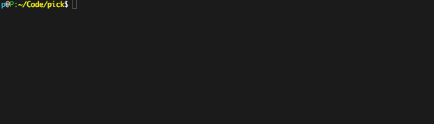

# pick

**pick** is a small python library to help you create curses based
interactive selection list in the terminal.

|         Basic          |         Multiselect          |
| :--------------------: | :--------------------------: |
|  |  |

## Installation

    $ pip install pick

## Usage

**pick** comes with a simple api:

    >>> from pick import pick

    >>> title = 'Please choose your favorite programming language: '
    >>> options = ['Java', 'JavaScript', 'Python', 'PHP', 'C++', 'Erlang', 'Haskell']
    >>> option, index = pick(options, title)
    >>> print(option)
    >>> print(index)

**outputs**:

    >>> C++
    >>> 4

**pick** multiselect example:

    >>> from pick import pick

    >>> title = 'Please choose your favorite programming language (press SPACE to mark, ENTER to continue): '
    >>> options = ['Java', 'JavaScript', 'Python', 'PHP', 'C++', 'Erlang', 'Haskell']
    >>> selected = pick(options, title, multiselect=True, min_selection_count=1)
    >>> print(selected)

**outputs**:

    >>> [('Java', 0), ('C++', 4)]

## Options

- `options`: a list of options to choose from
- `title`: (optional) a title above options list
- `indicator`: (optional) custom the selection indicator, defaults to `*`
- `default_index`: (optional) set this if the default selected option
  is not the first one
- `multiselect`: (optional), if set to True its possible to select
  multiple items by hitting SPACE
- `min_selection_count`: (optional) for multi select feature to
  dictate a minimum of selected items before continuing

## Community Projects

[pickpack](https://github.com/anafvana/pickpack): A fork of `pick` to select tree data.
